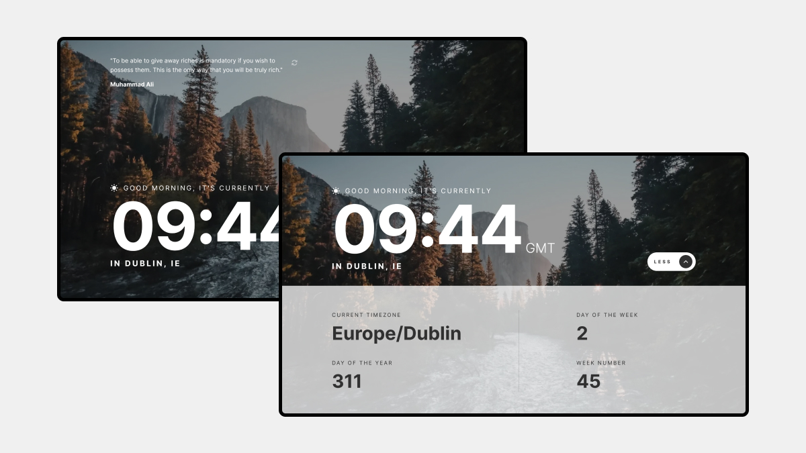
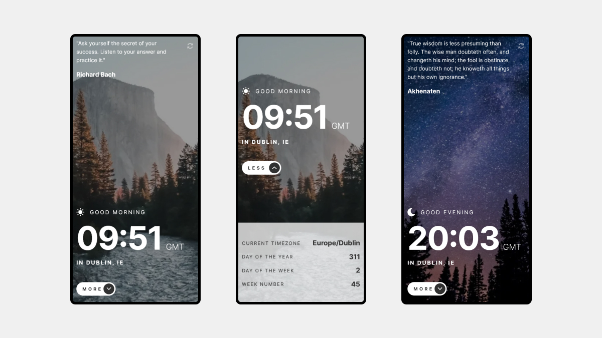

# Clock app

This is a Clock Application. Timekeeping tool that not only displays the current time but also provides location-specific information by leveraging the user's IP address.

## Table of contents

- [Overview](#overview)
  - [The challenge](#the-challenge)
  - [Screenshots](#screenshots)
  - [Links](#links)
- [My process](#my-process)
  - [Built with](#built-with)
  - [What I learned](#what-i-learned)
  - [Continued development](#continued-development)
  - [Useful resources](#useful-resources)
- [Author](#author)

## Overview

### The challenge

Users should be able to:

- View the optimal layout for the site depending on their device's screen size
- See hover states for all interactive elements on the page
- View the current time and location information based on their IP address
- View additional information about the date and time in the expanded state
- Be shown the correct greeting and background image based on the time of day they're visiting the site
- Generate random programming quotes by clicking the refresh icon near the quote

### Screenshots

#### Desktop

#### Mobile

### Links

- Frontend Mentor Solution URL: [https://your-solution-url.com](https://your-solution-url.com)
- Live Site URL: [https://clock-app-ivcenko.netlify.app/](https://clock-app-ivcenko.netlify.app/)

## My process

### Built with

- Semantic HTML5 markup
- CSS custom properties
- Flexbox
- CSS Grid
- Mobile-first workflow
- [React](https://react.dev/) - JS library
- [TypeScript](https://www.typescriptlang.org/) - Programming Language
- [Axios](https://axios-http.com/) - Promise based HTTP client, used for data fetching
- [React Query](https://tanstack.com/query/latest/) - Powerful asynchronous state management
- [Valibot](https://valibot.dev/) - Server requests data validation

### What I learned

- How to work with 3 different API's
- How to create real-time functionality
- Implemented data retrieval functions for improved code organization
- Unit Testing

### Continued development

In future projects, I would like to continue focusing on Unit Testing and Error Handling.

### Useful resources

- [Practical React Query](https://tkdodo.eu/blog/practical-react-query) - Discover a fantastic blog post by Dominik, where he provides a comprehensive and insightful explanation of React Query.

## Author

- Website - [Sergejs Ivcenko](https://www.your-site.com)
- Frontend Mentor - [@Sergio0831](https://www.frontendmentor.io/profile/Sergio0831)
- LinkedIn - [ivcenko](https://www.linkedin.com/in/ivcenko/)
